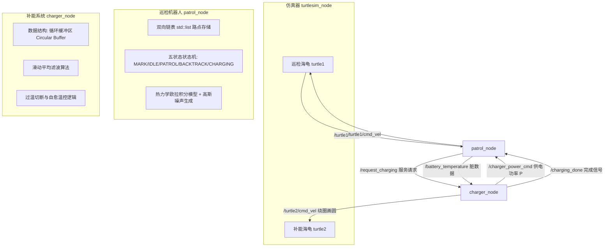

# ROS 2 双向链表巡检海龟与智能补能温控系统 (`sheep_patrol`)

本项目为《数据结构 × ROS 2 机器人》跨学科实验成果工程，基于 **Ubuntu 22.04 + ROS 2 Humble + turtlesim** 平台构建。

系统实现了一套完整的**“巡检机器人双向链表巡逻/原路回撤 + 补能站智能充电/循环缓冲区滤波/过温断电自愈”**闭环系统。

---

## 一、 系统架构与计算图设计

系统由 **两只乌龟 + 两个核心节点** 协同交互：



### 1. 通信接口与协议定义
| 通信名称 | 通信机制 | 消息/服务类型 | 作用描述 |
| :--- | :--- | :--- | :--- |
| `/start_patrol` | 话题订阅 | `std_msgs/msg/Empty` | 指令终端触发海龟从补能站出发开始巡检 |
| `/trigger_backtrack` | 话题订阅 | `std_msgs/msg/Empty` | 模拟电量不足，触发海龟沿双向链表原路倒退回撤 |
| `/request_charging` | 服务通信 | `std_srvs/srv/SetBool` | 海龟回撤到补能站后，向补能系统申请开始充电 |
| `/battery_temperature` | 话题发布 | `std_msgs/msg/Float64` | 巡检海龟上报叠加高斯白噪声的传感器温度数据 |
| `/charger_power_cmd` | 话题发布 | `std_msgs/msg/Float64` | 补能系统下发实时产热功率 $P$（充电 $100\text{W}$ / 切断 $0\text{W}$） |
| `/charging_done` | 话题发布 | `std_msgs/msg/Empty` | 补能系统通知巡检海龟已达到有效充电时长，已充满 |
| `/turtle2/cmd_vel` | 话题发布 | `geometry_msgs/msg/Twist` | 补能系统控制 `turtle2` 围绕补能站画圆指示充电中 |

---

## 二、 核心数据结构与算法

### 1. 双向链表（Doubly Linked List）
* **应用场景**：巡检路线与回溯路径存储。
* **节点定义**：
  ```cpp
  struct Waypoint { double x; double y; };
  std::list<Waypoint> path_; // 补能站(5.5, 5.5) <-> 点1 <-> 点2 <-> 点3 <-> 点4
  ```
* **算法优势**：
  * 前进巡检：`++it_`（等价于 `p = p->next`），$O(1)$ 时间复杂度；
  * 中途回撤：`--it_`（等价于 `p = p->prev`），$O(1)$ 时间复杂度，天然利用前后双向指针原路回溯，无需动态分配辅助堆栈。

### 2. 循环缓冲区滑动平均滤波（Circular Buffer）
* **应用场景**：在补能系统端消除传感器高斯白噪声 $\mathcal{N}(0, \sigma^2)$。
* **数据结构实现**（见 `include/sheep_patrol/circular_buffer_filter.hpp`）：
  ```cpp
  template <size_t Capacity = 15>
  class CircularBufferFilter {
      double buffer_[Capacity];
      size_t head_ = 0, count_ = 0;
      double sum_ = 0.0;
      // 插入新样本并淘汰最老样本，均值维护耗时严格保持 O(1)
  };
  ```
* **算法优势**：相较于常规数组每次滑窗需要移动元素（$O(N)$），循环缓冲区通过头指针取模 `(head_ + 1) % Capacity`，以 $O(1)$ 空间与时间开销实现无延迟实时滤波。

---

## 三、 电池热力学物理模型与安全自愈闭环

### 1. 物理模型（牛顿冷却定律 + 能量守恒）
充电过程中电池产生焦耳热（功率 $P$），同时向环境介质散热：
$$C \frac{dT}{dt} = P - h (T - T_{amb})$$

在离散控制系统中采用**一阶欧拉积分**（控制步长 $\Delta t = 0.05\text{s}$）：
$$T_{k+1} = T_k + \frac{\Delta t}{C} \Big[ P_k - h (T_k - T_{amb}) \Big]$$

传感器加噪输出：
$$T_{pub} = T_k + \mathcal{N}(0, \sigma)$$

* 参数配置：环境温度 $T_{amb}=25.0^\circ\text{C}$，热容 $C=18.0\text{J/}^\circ\text{C}$，散热系数 $h=1.5\text{W/}^\circ\text{C}$，噪声标准差 $\sigma=1.2^\circ\text{C}$。

### 2. 过温断电与自愈闭环时序
1. **升温阶段**：补能系统供电 $P = 100\text{W}$，`turtle2` 绕圈画圆（$v=1.0\text{m/s}, \omega=1.0\text{rad/s}$），温度呈指数上升；
2. **超温保护**：滤波温度超过**损毁阈值 $60.0^\circ\text{C}$**，补能系统瞬间切断电源（$P=0\text{W}$），`turtle2` 立即停转；
3. **自然散热**：因 $P=0$，方程退化为纯自然指数散热，温度平稳回落；
4. **冷却恢复**：滤波温度降至**安全阈值 $42.0^\circ\text{C}$** 以下，自动恢复供电（$P=100\text{W}$），`turtle2` 恢复画圆继续充能；
5. **充满待命**：有效充电累计满 $15.0\text{s}$，充能完毕，`turtle1` 恢复待命状态。

---

## 四、 编译与运行指南

### 方法 A：在 Ubuntu 22.04 (ROS 2 Humble) 本地或虚拟机运行

#### 1. 克隆代码至工作空间
```bash
mkdir -p ~/ros2_ws/src
cd ~/ros2_ws/src
git clone https://github.com/WastonGura/ros2.git sheep_patrol
```

#### 2. 编译工程
```bash
cd ~/ros2_ws
source /opt/ros/humble/setup.bash
colcon build --packages-select sheep_patrol
source install/setup.bash
```

#### 3. 一键启动完整仿真系统
```bash
ros2 launch sheep_patrol patrol_simulation.launch.py
```
*(系统将自动启动 turtlesim 窗口、生成 turtle2 补能小海龟、并完成巡检点地图标定)*

---

### 方法 B：使用 Docker / Web VNC 极速体验（免安装 ROS 2）

本仓库提供了带有浏览器 Web 桌面的 Docker Compose 配置：

```bash
# 启动容器
docker compose up -d

# 打开浏览器访问
http://localhost:6080/
```
在浏览器内的终端中进入 `/home/ubuntu/ros2_ws` 即可直接编译运行。

---

## 五、 实验操作与验收演示步骤

打开一个新终端，执行以下指令控制全流程：

1. **触发巡检**：
   ```bash
   ros2 topic pub --once /start_patrol std_msgs/msg/Empty "{}"
   ```
   *观察：`turtle1` 从补能站出发，沿双向链表依次巡检路点 1 -> 2 -> 3。*

2. **触发中途回撤（模拟电量不足）**：
   在海龟巡检途中任意时刻执行：
   ```bash
   ros2 topic pub --once /trigger_backtrack std_msgs/msg/Empty "{}"
   ```
   *观察：`turtle1` 立即放弃后续路点，沿原路逐点倒退回补能站 (5.5, 5.5)。*

3. **观察自动补能闭环**：
   * 回撤到站后，自动请求充电；
   * `turtle2` 开始围绕 `turtle1` 绕圈画圆；
   * 终端实时打印滤波前后的温度对比；
   * 达到 60°C 时触发过温切断停转，降至 42°C 后恢复画圆；
   * 累计充能满 15 秒后提示充电完成，系统恢复就绪，可随时再次发起 `/start_patrol`。

---

## 六、 许可与作者
* 维护者：WastonGura (WastonGura@outlook.com)
* 许可证：Apache-2.0
